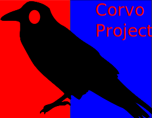

# Projeto Corvo
 




O projeto Corvo é focado da internacionalização de tokens para o idioma nativo do sistema. No momento,estou trabalhando para formatação de datas e moedas, mas estou sempre aberto para novas contribuições.

---

Como utilizá-lo

- Formatando número para extenso
```
    const corvo = require('corvo')

    console.log(corvo.numero.extensoTag`Paguei ${80} em uma blusa.`) 
    # Paguei oitenta em uma blusa

```
- Formatando data para extenso
```
    const corvo = require('corvo')
    console.log(corvo.data.brShortFormat(new Date())) # 11/03/2018
    console.log(corvo.data.longFormat(new Date())) # 11 de abril de 2018
    console.log(corvo.data.longlongFormat(new Date())) # onze de abril de 2018 
```
- Formatando apenas o número
``` 
    const corvo = require('corvo')
    console.log(corvo.numero.formataPorExtenso(10)) # dez
```